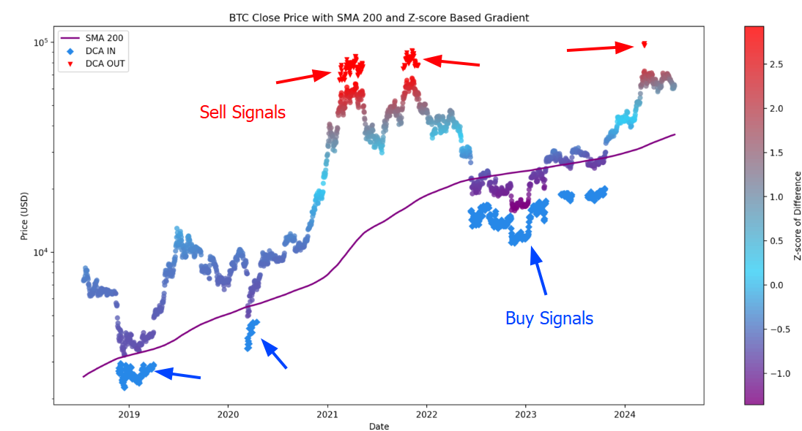
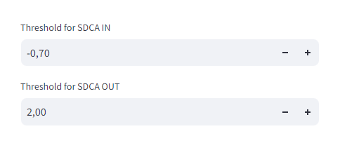

### Crypto SDCA System

#### Overview
The Crypto SDCA System is designed for long-term investing in cryptocurrencies, employing systematic dollar-cost averaging (SDCA) principles. It utilizes historical price data and statistical metrics to automate investment decisions based on predefined buy and sell thresholds.

#### Key Features
- **Z-score Calculation**: Normalizes the difference using Z-score, indicating how far the current price deviates from the SMA.
- **Gradient Color Visualization**: Displays the price chart with a gradient color background based on the Z-score of the difference, facilitating visual trend analysis.

1. **200-week Moving Average**: Computes the 200-week SMA to establish a baseline trend indicator.
2. **Z-score and Gradient Visualization**: Calculates the Z-score of the difference between the current price and the SMA. This Z-score is used to color-code the price chart, highlighting periods of divergence from the long-term trend.
3. **Threshold-based Signals**: Identifies buying opportunities when the Z-score of the distance between the price and SMA falls below -0.70, indicated by upward triangles on the chart. It also identifies selling opportunities when the Z-score rises above a predefined sell threshold (e.g., +2.00), marked by downward triangles.

4. **Automated Insights**: Provides a systematic approach to cryptocurrency investing, automating decisions based on statistical analysis of price trends.

#### Benefits
- **Objective Decision Making**: Removes emotional bias by relying on statistical metrics and predefined thresholds for buying and selling.
- **Long-term Focus**: Targets long-term investment opportunities by leveraging SMA and Z-score analysis.
- **Visual Clarity**: Enhances decision-making with visual representations of price trends.

#### Disclaimer
This system is for informational purposes only and should not be considered financial advice. Investors should conduct their own research or consult with a financial advisor before making investment decisions.
